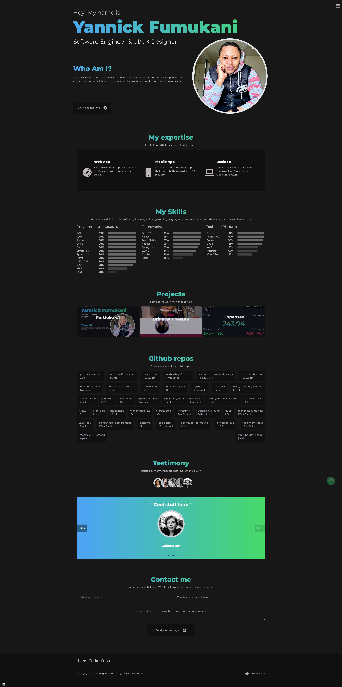

<h1>Yannick Fumukani | portfolio v.1</h1>

Welcome to my public portfolio repository! This repository serves as a showcase of my skills, projects, and accomplishments as a Software Engineer. Here, you will find a collection of my work that demonstrates my expertise and creativity in various domains. 

<h2>Technologies used: </h2>
<ul>
<li>NextJs 13.1</li>
<li>Tailwind CSS</li>
<li>Framer motion</li>
<li>Nuka carousel</li>
<li>Typescript</li>
</ul>

<h2>Skills and technologies:</h2>
<ul>
<li>Programming Languages: SQL, Java, Python, Swift, C#, Javascript, Typescript, Html, CSS/SCSS, C/C++, Shell
</li>
<li>Web Development: HTML, CSS, JavaScript, React, Angular, Node.js, etc.</li>
<li>Database Management: MySQL, MongoDB, PostgreSQL, etc.</li>
<li>Mobile Development: Android, iOS, React Native</li>
<li>Others: Linux, Docker, AWS, Figma etc.</li>
</ul>

<h3>Portfolio url: <a href="https://www.yannickfumukani.com">www.yannickfumukani.com</a></h3>

<h2>Limitations</h2>

This project is not meant to be used without permission, if you feel like using it please contact me at slashcs7@hotmail.com

<h2>Getting in touch</h2>

If you have any questions, feedback, or would like to collaborate on a project, please feel free to reach out to me. You can contact me via email or connect with me on LinkedIn, where you can find additional information about my professional background and experience.

Thank you for visiting my portfolio repository, and I hope you enjoy exploring my work.

